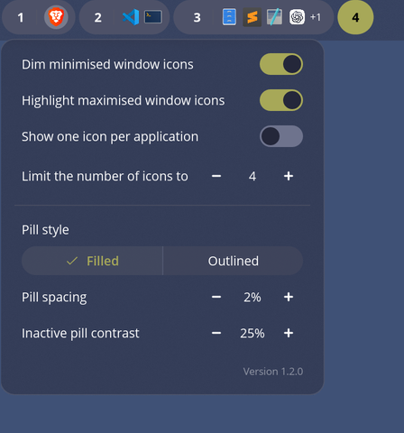

# Workspace Icons

Workspace Icons is a third-party [COSMIC](https://en.wikipedia.org/wiki/COSMIC_desktop) panel applet based on the COSMIC
Numbered Workspaces applet. It shows application icons beside each workspace
number so you can see where windows are at a glance.

## Screenshots


<br />



<br />


## Features

- Displays application icons beside each workspace number.
- Associates windows with the correct workspace and monitor.
- Shows an overflow count when a workspace has many applications.
- Dims application icons when all windows for that app are minimized.
- Highlights icons for apps with maximized windows.
- Preserves workspace switching, scrolling, and workspace overview behavior.

## Pill Colors

Pill colors use semantic COSMIC theme tokens, so their rendered values follow
the user's current theme. In the table below, `P` is the configured inactive
pill opacity, `H` is `P + 15` percentage points capped at 100%, and `W` is the
configured outline thickness.

| State | Mode | Interaction | Fill | Border | Workspace number | Other foreground | Separator |
|---|---|---|---|---|---|---|---|
| Inactive | Filled | Resting | `current_container().component.base` at `P` | None | `current_container().component.on` | `current_container().component.on` | `current_container().divider` |
| Inactive | Filled | Hovered | `current_container().component.hover` at `H` | None | `current_container().component.on` | `current_container().component.on` | `current_container().divider` |
| Inactive | Outlined | Resting | None | `current_container().component.base` at `P`, width `W` | `current_container().component.on` | `current_container().component.on` | `current_container().divider` |
| Inactive | Outlined | Hovered | `current_container().component.hover` at `H` | None | `current_container().component.on` | `current_container().component.on` | `current_container().divider` |
| Active | Filled | Resting | `accent_button.base` | None | `accent_button.on` | `accent_button.on` | `current_container().divider` |
| Active | Filled | Hovered | `accent_button.hover` | None | `accent_button.on` | `accent_button.on` | `current_container().divider` |
| Active | Outlined | Resting | None | `accent_button.base`, width `W` | `accent_text`, falling back to `accent_button.base` | `current_container().component.on` | `accent_text`, falling back to `accent_button.base` |
| Active | Outlined | Hovered | `accent_button.hover` | None | `accent_button.on` | `accent_button.on` | `accent_button.on` |
| Urgent | Filled | Resting | `palette.neutral_3` | `destructive_button.base`, 1 px | `destructive_button.base` | `destructive_button.base` | `destructive_button.base` |
| Urgent | Filled | Hovered | `current_container().component.hover` at native alpha | `destructive_button.base`, 1 px | `destructive_button.base` | `destructive_button.base` | `destructive_button.base` |
| Urgent | Outlined | Resting | None | `destructive_button.base`, width `W` | `destructive_button.base` | `destructive_button.base` | `destructive_button.base` |
| Urgent | Outlined | Hovered | `current_container().component.hover` at native alpha | `destructive_button.base`, width `W` | `destructive_button.base` | `destructive_button.base` | `destructive_button.base` |

Hovered outlined active and inactive pills remove their border after filling to
avoid a visible seam. Urgent pills keep their destructive border on hover. If a
workspace is both active and urgent, active styling takes precedence.

## Install From Source

Requires COSMIC Desktop development dependencies and a Rust toolchain.

```bash
git clone https://github.com/crocodile/cosmic-ext-applet-workspace-icons.git
cd cosmic-ext-applet-workspace-icons
just install
```

Then open COSMIC panel settings and add **Workspace Icons**.

## Testing The Flatpak Build

Workspace Icons is intended to be distributed as a Flatpak through the COSMIC
Store. Until then, the Flatpak packaging draft lives in
`packaging/io.github.crocodile.cosmic-ext-applet-workspace-icons/`.

Before testing the Flatpak, remove any source install first so COSMIC does not
show stale or duplicate applet entries:

```bash
just uninstall
```

Then install the local Flatpak build:

```bash
flatpak-builder --user --install --force-clean \
  build-dir/workspace-icons-flatpak \
  packaging/io.github.crocodile.cosmic-ext-applet-workspace-icons/io.github.crocodile.cosmic-ext-applet-workspace-icons.json
```

If the applet list does not refresh immediately, log out and back in. After
adding **Workspace Icons** to the panel, confirm that the Flatpak version is
running with:

```bash
flatpak ps
```

To remove the local Flatpak test install:

```bash
flatpak uninstall --user io.github.crocodile.cosmic-ext-applet-workspace-icons
```

## Development

```bash
just build
just install
just uninstall
cargo fmt --all -- --check
cargo check
cargo test
```

For a technical map of how this differs from COSMIC's Numbered Workspaces applet,
see [Changes From COSMIC Numbered Workspaces](docs/numbered-workspaces-changes.md).

## License

GPL-3.0-only.
